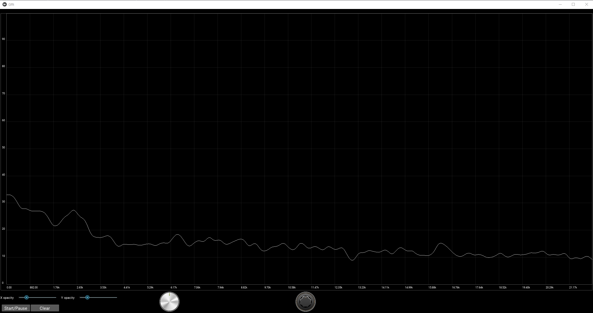

# Welcome to the Sudio 🎵
 
`sudio` is an `Open-source`,  `easy-to-use` digital audio processing library featuring both a **real-time**, **non-real-time** mix/edit platform. 


## Abstract

Audio signal processing is a highly active research field where digital signal processing theory meets human sound perception and real-time programming requirements. It has a wide range of applications in computers, gaming, and music technology, to name a few of the largest areas. Successful applications include for example perceptual audio coding, digital music synthesizers, and music recognition software. 

#### Real-time audio processing

For live digital audio systems with high-resolution multichannel functionalities, it is desirable to have accurate latency control and estimation over all the stages of digital audio processing chain. 

The sudio is written flexible can used for high level audio processing algorithm and other system factors, which might cause the latency effects. It also can estimate the synchronization and delay of multiple channels.

#### Non-Realtime processing:

Sudio is a comprehensive library for mixing, editing, and recording audio content.


#### Audio data maintaining process:

The sudio used additional cached files to reduce dynamic memory usage and improve performance, meaning that audio data storage methods could have different execution times based on the stored files. Thanks to that, 
Sudo can manage various audio streams from audio files or operating systems without any size limitation.

</br>
</br>
</br>
</br>
<div align="center"> 🎵 <b>Sudio</b> is like a <b>budding musician</b> finding its rhythm. Your support can help it <b>compose a symphony</b>. 🎶</div>
</br>
</br>
</br>
</br>

## Installation


##### Latest PyPI stable release (previous version)

    pip install sudio

##### Latest development release on GitHub

Pull and install pre-release `main` branch  (recommended):

    pip install git+https://github.com/MrZahaki/sudio.git


## Quick start

#### Audio playback

```python
import sudio

su = sudio.Master()
su.add('baroon.mp3')
su.echo('baroon')
``` 

the record with the name of baroon will be played on the stdout audio stream. 

#### Audio Manipulation

##### Time Domain Slicing


You can easily slice audio files to play specific segments:

```python
su = sudio.Master()
song = su.add('baroon.mp3')
su.echo(song[12: 27.66])

# Play from 30 seconds to the end
su.echo(song[30:])

# Play the first 15 seconds
su.echo(song[:15])
```

##### Combining Audio Segments

You can join multiple segments of audio: 

```python
su = sudio.Master()
rec = su.add('baroon.mp3')

# method 1
su.echo(rec[12: 27.66, 65: 90])

# method 2
result = rec[12: 27.66].join(rec[65: 90])

# Combine multiple segments
medley = song[10:20].join(song[40:50], song[70:80])
su.echo(medley)
```

The audio record is split into two parts, the first one 12-27.66 seconds, and the last one 65-90 seconds, then the sliced records are merged and played in the stream.

##### Audio Basic Effects

###### Volume Adjustment

Adjust the volume of an audio segment:

```python
su = sudio.Master()
song = su.add('song.mp3')

# Double the volume
loud_segment = song[10:20] * 2

# Halve the volume
quiet_segment = song[30:40] / 2

su.echo(loud_segment.join(quiet_segment))
```

###### Applying Filters

Apply frequency filters to audio:


```python
su = sudio.Master()
song = su.add('song.mp3')

# Apply a low-pass filter (keep frequencies below 1000 Hz)
low_pass = song[:'1000']

# Apply a high-pass filter (keep frequencies above 500 Hz)
high_pass = song['500':]

# Apply a band-pass filter (keep frequencies between 500 Hz and 2000 Hz)
band_pass = song['500':'2000']

su.echo(low_pass.join(high_pass, band_pass))
```

###### Complex Slicing

```python
su = sudio.Master()
baroon = su.add('baroon.mp3')
su.echo(baroon[5:10, :'1000', 10: 20, '1000': '5000'])
```

In the example above, a low-pass filter with a cutoff frequency of 1 kHz is applied to the record from 5 to 10 seconds, then a band-pass filter is applied from 10 to 20 seconds, and finally they are merged.

######  Custom Fade-In and Mixing

```python
import sudio
from sudio.types import SampleFormat
import numpy as np

su = sudio.Master()
song = su.add('example.mp3')

fade_length = int(song.get_sample_rate() * 5)  # 5-second fade
fade_in = np.linspace(0, 1, fade_length)

with song.unpack(astype=SampleFormat.formatFloat32) as data:
    data[:, :fade_length] *= fade_in
    song.set_data(data)

modified = song[:30] + song[:15, :'100'] * 3
su.echo(modified)
su.export(modified, 'modified_song.wav')
```

This example demonstrates advanced audio manipulation techniques:

1. **Fade-In Effect**: We create a 5-second linear fade-in effect.

2. **Data Type Conversion**: The audio data is converted to float32 for precise calculations.

3. **Unpacking and Repacking**: We use `unpack()` to access raw audio data, modify it, and then `set_data()` to apply changes.

4. **Audio Slicing and Mixing**:
   - `song[:30]`: Takes the first 30 seconds of the audio.
   - `song[:15, :'100']`: Takes the first 15 seconds and applies a low-pass filter at 100 Hz.
   - The `* 3` multiplies the amplitude of the filtered segment.
   - These segments are then added together.

5. **Playback and Export**: The modified audio is played and exported to a new file.

This example showcases the library's capability to perform complex audio manipulations, combining time-domain operations (fade-in, slicing) with frequency-domain filtering and amplitude adjustments.


##### Audio Analysis

Perform simple analysis on audio files:

```python
su = sudio.Master()
song = su.add('song.mp3')

# Get audio duration
duration = song.get_duration()
print(f"Song duration: {duration} seconds")

# Get sample rate
sample_rate = song.get_sample_rate()
print(f"Sample rate: {sample_rate} Hz")

# Get number of channels
channels = song.get_nchannels()
print(f"Number of channels: {channels}")
```

##### Exporting Modified Audio

After manipulating audio, you can save the results:

```python
su = sudio.Master()
song = su.add('song.mp3')

# Create a modified version
modified = song[30:60] * 1.5  # 30 seconds from 30s mark, amplified

# Export to a new file
su.export(modified, 'modified_song.wav')
```

##### Mixing and Shifting Tracks

When adding two Wrap objects, the combined audio will be as long as the longer one, mixing overlapping parts. Adding a constant shifts the waveform up while keeping the original duration. This allows for flexible audio mixing and simple DC offset adjustments.

```python
import sudio
import numpy as np

su = sudio.Master()

# Add two audio files
song1 = su.add('song1.mp3')  # Assuming this is a 30-second audio
song2 = su.add('song2.mp3')  # Assuming this is a 40-second audio

# Add the two songs
combined = song1 + song2

# Play the combined audio
su.echo(combined)

# Add a constant value to shift the audio
shifted = song1 + 0.1

# Play the shifted audio
su.echo(shifted)

# Print durations
print(f"Song1 duration: {song1.get_duration()} seconds")
print(f"Song2 duration: {song2.get_duration()} seconds")
print(f"Combined duration: {combined.get_duration()} seconds")
print(f"Shifted duration: {shifted.get_duration()} seconds")
```


#### Audio Streaming

##### Basic Streaming with Pause and Resume

This example demonstrates how to control audio playback using the sudio library, including starting, pausing, resuming, and stopping a stream.

```python
import sudio
import time

# Initialize the audio master
su = sudio.Master()
su.start()

# Add an audio file to the master
record = su.add('example.mp3')
stream = su.stream(record)

# Enable stdout echo
su.echo()

# Start the audio stream
stream.start()
print(f"Current playback time: {stream.time} seconds")

# Pause the playback after 5 seconds
time.sleep(5)
stream.pause()
print("Paused playback")

# Resume playback after 2 seconds
time.sleep(2)
stream.resume()
print("Resumed playback")

# Stop playback after 5 more seconds
time.sleep(5)
stream.stop()
print("Stopped playback")
```

This script showcases basic audio control operations, allowing you to manage playback with precise timing.


##### Basic Streaming with Jumping to Specific Times in the Audio

This example illustrates how to start playback and jump to a specific time in an audio file.

```python
import sudio
import time

# Initialize the audio master
su = sudio.Master()
su.start()

# Add a long audio file to the master
record = su.add('long_audio.mp3')
stream = su.stream(record)

# Enable stdout echo
su.echo()

# Start the audio stream
stream.start()
print(f"Starting playback at: {stream.time} seconds")

# Jump to 30 seconds into the audio after 5 seconds of playback
time.sleep(5)
stream.time = 30
print(f"Jumped to: {stream.time} seconds")

# Continue playback for 10 more seconds
time.sleep(10)
print(f"Current playback time: {stream.time} seconds")

# Stop the audio stream
stream.stop()
```

This script demonstrates how to navigate within an audio file, which is useful for long audio content or when specific sections need to be accessed quickly.

##### Streaming with Volume Control

This example shows how to dynamically control the volume of an audio stream using a custom pipeline.

```python
import sudio
import time
import sudio.types

# Initialize the audio master with a specific input device
su = sudio.Master(std_input_dev_id=2)
su.start()

# Add an audio file to the master
record = su.add('example.mp3')
stream = su.stream(record)

# Define a function to adjust the volume
def adjust_volume(data, args):
    return data * args['volume']

# Create a pipeline and append the volume adjustment function
pip = sudio.Pipeline()
pip.append(adjust_volume, args={'volume': 1.0})

# Start the pipeline
pip.start()

# Add the pipeline to the master
pipeline_id = su.add_pipeline(pip, process_type=sudio.types.PipelineProcessType.MAIN)
su.set_pipeline(pipeline_id)

# Enable stdout echo
su.echo()

# Start the audio stream
stream.start()
print("Playing at normal volume")
time.sleep(10)

# Adjust the volume to 50%
pip.update_args(adjust_volume, {'volume': 0.5})
print("Reduced volume to 50%")
time.sleep(10)

# Restore the volume to normal
pip.update_args(adjust_volume, {'volume': 1.0})
print("Restored normal volume")
time.sleep(10)

# Stop the audio stream
stream.stop()
```

This example introduces a more complex setup using a custom pipeline to dynamically adjust the audio volume during playback. It's particularly useful for applications requiring real-time audio processing or user-controlled volume adjustments.


## Table of contents:

- [Welcome to the Sudio 🎵](#welcome-to-the-sudio-)
  - [Abstract](#abstract)
      - [Real-time audio processing](#real-time-audio-processing)
      - [Non-Realtime processing:](#non-realtime-processing)
      - [Audio data maintaining process:](#audio-data-maintaining-process)
  - [Installation](#installation)
        - [Latest PyPI stable release (previous version)](#latest-pypi-stable-release-previous-version)
        - [Latest development release on GitHub](#latest-development-release-on-github)
  - [Quick start](#quick-start)
      - [Audio playback](#audio-playback)
      - [Audio Manipulation](#audio-manipulation)
        - [Time Domain Slicing](#time-domain-slicing)
        - [Combining Audio Segments](#combining-audio-segments)
        - [Audio Basic Effects](#audio-basic-effects)
          - [Volume Adjustment](#volume-adjustment)
          - [Applying Filters](#applying-filters)
          - [Complex Slicing](#complex-slicing)
          - [Custom Fade-In and Mixing](#custom-fade-in-and-mixing)
        - [Audio Analysis](#audio-analysis)
        - [Exporting Modified Audio](#exporting-modified-audio)
        - [Mixing and Shifting Tracks](#mixing-and-shifting-tracks)
      - [Audio Streaming](#audio-streaming)
        - [Basic Streaming with Pause and Resume](#basic-streaming-with-pause-and-resume)
        - [Basic Streaming with Jumping to Specific Times in the Audio](#basic-streaming-with-jumping-to-specific-times-in-the-audio)
        - [Streaming with Volume Control](#streaming-with-volume-control)
  - [Table of contents:](#table-of-contents)
    - [Examples and Advanced Usage](#examples-and-advanced-usage)
      - [Short-time Fourier transform](#short-time-fourier-transform)
        - [prerequisites](#prerequisites)
  - [API Documentation](#api-documentation)
    - [Master](#master)
      - [Key Features](#key-features)
      - [Initialization](#initialization)
        - [Key Parameters](#key-parameters)
      - [Advanced Features](#advanced-features)
      - [Usage Examples](#usage-examples)
      - [Methods](#methods)
        - [add\_file](#add_file)
        - [add](#add)
          - [Parameters](#parameters)
          - [Returns](#returns)
          - [Notes](#notes)
          - [Examples](#examples)
          - [Exceptions](#exceptions)
        - [start](#start)
          - [Description](#description)
          - [Returns](#returns-1)
          - [Behavior](#behavior)
          - [Usage Notes](#usage-notes)
          - [Examples](#examples-1)
          - [Exceptions](#exceptions-1)
        - [recorder](#recorder)
          - [Parameters](#parameters-1)
          - [Returns](#returns-2)
          - [Description](#description-1)
          - [Behavior](#behavior-1)
          - [Usage Notes](#usage-notes-1)
          - [Examples](#examples-2)
          - [Exceptions](#exceptions-2)
        - [load](#load)
        - [get\_record\_info](#get_record_info)
        - [syncable](#syncable)
        - [sync](#sync)
        - [del\_record](#del_record)
        - [export](#export)
        - [get\_record\_names](#get_record_names)
        - [get\_nperseg](#get_nperseg)
        - [get\_nchannels](#get_nchannels)
        - [get\_sample\_rate](#get_sample_rate)
        - [stream](#stream)
        - [mute](#mute)
        - [unmute](#unmute)
        - [echo](#echo)
        - [wrap](#wrap)
        - [clean\_cache](#clean_cache)
        - [add\_pipeline](#add_pipeline)
        - [set\_pipeline](#set_pipeline)
        - [set\_window](#set_window)
    - [StreamControl](#streamcontrol)
      - [Methods](#methods-1)
        - [isready](#isready)
        - [is\_streaming](#is_streaming)
        - [start](#start-1)
        - [resume](#resume)
        - [stop](#stop)
        - [pause](#pause)
        - [enable\_loop](#enable_loop)
        - [disable\_loop](#disable_loop)
      - [Properties](#properties)
        - [time](#time)
          - [Getter](#getter)
          - [Setter](#setter)
    - [WrapGenerator](#wrapgenerator)
      - [Methods](#methods-2)
        - [get\_sample\_format](#get_sample_format)
        - [get\_sample\_width](#get_sample_width)
        - [get\_master](#get_master)
        - [get\_size](#get_size)
        - [get\_cache\_size](#get_cache_size)
        - [get\_nchannels](#get_nchannels-1)
        - [get\_sample\_rate](#get_sample_rate-1)
        - [get\_duration](#get_duration)
        - [join](#join)
      - [Magic methods](#magic-methods)
        - [getitem](#getitem)
        - [del](#del)
        - [str](#str)
        - [mul](#mul)
        - [truediv](#truediv)
        - [pow](#pow)
        - [add](#add-1)
        - [sub](#sub)
        - [call](#call)
    - [Wrap](#wrap-1)
      - [Methods](#methods-3)
        - [get\_sample\_format](#get_sample_format-1)
        - [get\_sample\_width](#get_sample_width-1)
        - [get\_master](#get_master-1)
        - [get\_size](#get_size-1)
        - [get\_sample\_rate](#get_sample_rate-2)
        - [get\_nchannels](#get_nchannels-2)
        - [get\_duration](#get_duration-1)
        - [join](#join-1)
        - [unpack](#unpack)
        - [get\_data](#get_data)
        - [is\_packed](#is_packed)
        - [get](#get)
        - [set\_data](#set_data)
      - [Magic methods](#magic-methods-1)
        - [del](#del-1)
        - [str](#str-1)
        - [getitem](#getitem-1)
        - [mul](#mul-1)
        - [truediv](#truediv-1)
        - [pow](#pow-1)
        - [add](#add-2)
        - [sub](#sub-1)
    - [Pipeline](#pipeline)
      - [Parameters](#parameters-2)
      - [Methods](#methods-4)
        - [clear](#clear)
        - [run](#run)
        - [insert](#insert)
          - [Parameters](#parameters-3)
          - [Reterns](#reterns)
        - [append](#append)
        - [sync](#sync-1)
        - [aasync](#aasync)
        - [delay](#delay)
        - [set\_timeout](#set_timeout)
        - [get\_timeout](#get_timeout)
        - [put](#put)
        - [get](#get-1)
      - [Magic methods](#magic-methods-2)
        - [call](#call-1)
        - [delitem](#delitem)
        - [len](#len)
        - [getitem](#getitem-2)
  - [LICENCE](#licence)


### [Examples and Advanced Usage](#examples-and-advanced-usage)

<br />

#### Short-time Fourier transform

The [Short-time Fourier transform (STFT)](./examples/STFT/), is a Fourier-related transform used to determine the sinusoidal frequency and phase content of local sections of a signal as it changes over time. In practice, the procedure for computing STFTs is to divide a longer time signal into shorter segments of equal length and then compute the Fourier transform separately on each shorter segment. This reveals the Fourier spectrum on each shorter segment. One then usually plots the changing spectra as a function of time, known as a spectrogram or waterfall plot, such as commonly used in Software Defined Radio (SDR) based spectrum displays. 


##### prerequisites

```py
pip install sudio
pip install kivy
```

<br />




<br />

<!--
### [Usage](#usage)

### Prerequisites

Sudio has written in the python language, you can see the python documentation from this link. 
This library used scientific computing packages to manipulate data like the numpy and scipy.
-->

## API Documentation

### Master

```py
sudio.Master
```

The Master class is the core component of the audio processing system. It manages audio input/output, signal processing, and provides a framework for advanced audio manipulation.

#### Key Features

1. **Flexible Device Configuration**: Supports both default and custom audio input/output devices.
2. **Multiple Audio Formats**: Handles various sample formats including 32-bit float, 32/24/16/8-bit integer.
3. **Windowing and Overlap**: Implements customizable windowing functions with overlap-add method.
4. **Multithreaded Processing**: Utilizes threading for efficient audio stream management.
5. **Pipeline System**: Allows creation and management of audio processing pipelines.
6. **File I/O**: Supports adding, loading, and exporting audio files.
7. **Real-time Processing**: Enables real-time audio manipulation through callback functions.

#### Initialization

The Master class is initialized with various parameters to configure the audio processing environment:

```python
master = Master(std_input_dev_id=None, std_output_dev_id=None, data_format=SampleFormat.formatInt16, ...)
```

##### Key Parameters

- `std_input_dev_id` / `std_output_dev_id`: Specify input/output device IDs. If None, uses system defaults.
- `data_format`: Sets the audio sample format (e.g., 16-bit integer, 32-bit float).
- `nperseg`: Number of samples per frame in each channel.
- `window`: Specifies the windowing function (e.g., 'hann', 'hamming').
- `input_dev_callback` / `output_dev_callback`: Custom callback functions for audio I/O.

#### Advanced Features

1. **Windowing**: Supports various window types with automatic NOLA (Nonzero Overlap Add) constraint checking.
2. **Stream Control**: Methods for muting, unmuting, and echoing audio streams.
3. **Pipeline Management**: Add, set, and disable audio processing pipelines.
4. **File Management**: Add, load, export, and delete audio records.
5. **Device Information**: Static methods to query available audio devices and their properties.

#### Usage Examples

1. **Basic Initialization**:
   ```python
   master = Master()
   master.start()
   ```

2. **Custom Input Device**:
   ```python
   master = Master(std_input_dev_id=1, data_format=SampleFormat.formatFloat32)
   ```

3. **Adding a Pipeline**:
   ```python
   pipeline = Pipeline()
   master.add_pipeline(pipeline, name="my_pipeline", process_type=PipelineProcessType.MAIN)
   master.set_pipeline("my_pipeline")
   ```

4. **Recording Audio**:
   ```python
   recorded_audio = master.recorder(record_duration=10, name="my_recording")
   ```

5. **Exporting Audio**:
   ```python
   master.export("my_recording", "path/to/output.wav")
   ```

The Master class provides a comprehensive suite of tools for audio processing, making it suitable for a wide range of applications from simple audio playback to complex real-time audio manipulation systems.


#### Methods

<br />
     
##### add_file

```py
sudio.Master.add_file(  self, filename: str, sample_format: SampleFormat = SampleFormat.formatUnknown, 
                        nchannels: int = None, sample_rate: int = None ,safe_load=True)
```

The add_file method used to Add an audio file to the local database. None value for the parameters means that they are automatically selected based on the properties of the audio file.

- **parameters**:

    - **filename**: path/name of the audio file
    - **sample_format**: optional; sample format (refer to the SampleFormat data field).
    - **nchannels**: optional;  number of audio channels
    - **sample_rate**: optional;  sample rate
    - **safe_load**: optional;  load an audio file and modify it according to the 'Master' attributes. (sample rate, sample format, number of channels, etc).

- **returns** WrapGenerator object


:memo: **Note:** supported files format: WAV, FLAC, VORBIS, MP3

:memo: **Note:** The audio data maintaining process has additional cached files to reduce dynamic memory usage and improve performance, meaning that, The audio data storage methods can have different execution times based on the cached files.


<br />

##### add

```py
sudio.Master.add(self, record, safe_load=True)
```

Adds a new record to the local database of the Master object.

###### Parameters

- `record`: The record to be added. Can be one of the following:
  - A `Wrap` or `WrapGenerator` object
  - A string path to an audio file (supported formats: mp3, WAV, FLAC, VORBIS)
  - AudioMetadata containing record data
  - A tuple `(record, name)` where `record` is any of the above, and `name` is a custom name for the record

- `safe_load`: bool, optional (default=True)
  - If True, audio files are loaded and modified to match the Master object's current settings

###### Returns

- `WrapGenerator`: A wrapped version of the added record

###### Notes

1. **Naming**: If a tuple `(record, name)` is provided, the second element is used as the record name. Otherwise, a name is automatically generated.

2. **Performance**: The method uses cached files to optimize memory usage and performance. This may cause varying execution times depending on the state of these cached files.

3. **Compatibility**: When `safe_load=True`, the method ensures that the added record is compatible with the current audio processing settings of the Master object.

###### Examples

```python
# Adding an audio file
master.add("path/to/audio.wav")

# Adding a wrapped record with a custom name
wrapped_record = some_wrap_generator()
master.add((wrapped_record, "my_custom_name"))

# Adding AudioMetadata record
series_record = AudioMetadata(...) # Record data
master.add(series_record)
```

###### Exceptions

- Raises `ValueError` if the record type is not recognized or if there's an issue with the file format.
- Raises `ImportError` if the number of channels in the record is incompatible with the Master object's settings when `safe_load=True`.

This method provides a flexible way to add various types of audio data to your project, with options for ensuring compatibility and custom naming.


<br />

##### start

```python
sudio.Master.start(self)
```

Initializes and starts the audio processing stream.

###### Description

The `start` method activates the configured audio stream, enabling real-time audio processing based on the Master object's current settings. It should be called after all desired configurations have been made.

###### Returns

- `self`: Returns the Master instance, allowing for method chaining.

###### Behavior

1. **Initialization**: Sets up the audio stream with the configured parameters (sample rate, format, channels, etc.).
2. **Thread Activation**: Starts all processing threads, enabling concurrent audio handling.
3. **Error Handling**: Raises exceptions if the stream is already started or if there are issues with stream initialization.

###### Usage Notes

- Call this method only once, after all configurations are complete.
- The audio processing runs in a separate thread after this method is called.
- Ensure all desired pipelines and audio settings are configured before calling `start`.

###### Examples

```python
# Basic usage
master = Master()
master.start()

# Method chaining
master = Master().start()

# Start after configuration
master = Master()
master.add_pipeline(some_pipeline)
master.set_window('hamming')
master.start()
```

###### Exceptions

- Raises `AssertionError` if the audio stream is already started.
- May raise other exceptions related to audio stream initialization, depending on the underlying audio library.

This method is crucial for activating the real-time audio processing capabilities of the Master object. Ensure all necessary configurations are done before calling `start`.

<br />

##### recorder

```python
sudio.Master.recorder(self, record_duration: float, name: str = None)
```

Records audio for a specified duration and stores it as a new record in the Master object's database.

###### Parameters

- `record_duration`: float
  - The duration of the recording in seconds.
- `name`: str, optional
  - A custom name for the recorded audio. If None, a timestamp-based name is generated.

###### Returns

- `Wrap`: A wrapped version of the recorded audio data.

###### Description

The `recorder` method captures audio input using the current settings of the Master object (sample rate, number of channels, etc.) for the specified duration. The recorded audio is automatically added to the Master's database and can be accessed later using the provided or generated name.

###### Behavior

1. **Initialization**: Sets up a temporary recording state in the Master object.
2. **Recording**: Captures audio data for the specified duration.
3. **Processing**: Processes the recorded data, including channel shuffling if necessary.
4. **Storage**: Writes the recorded data to a cached file and updates the Master's database.

###### Usage Notes

- The recording uses the current audio input settings of the Master object.
- The method temporarily modifies the internal state of the Master object during recording.
- Recorded audio is automatically added to the database and can be accessed or manipulated later.

###### Examples

```python
# Record for 5 seconds with an auto-generated name
recorded_audio = master.recorder(5)

# Record for 10 seconds with a custom name
recorded_audio = master.recorder(10, name="my_recording")

# Use the recorded audio
master.play(recorded_audio)
```

###### Exceptions

- Raises `KeyError` if the provided name already exists in the database.

This method provides a straightforward way to capture and store audio data within the Master object's ecosystem, making it easy to record and subsequently process or analyze audio segments.


<br />

##### load

```py
   sudio.Master.load(self, name: str, safe_load: bool=True,
                    series: bool=False) -> Union[WrapGenerator, Record])
```

The load method used to load a predefined record from database. Trying to load a record that was previously loaded, outputs a wrapped version of the named record.


- **parameters**:

  - **name**: The name of the record.
  - **safe_load**: if safe load is enabled this method tries to load a record in the local database, based on the master settings, like the frame rate and etc.
  - **series**: If enabled, attempting to load a record that has already been loaded will output the data series of the named record.

- **returns** optional; Wrapped object, Record obejct.

<br />


##### get_record_info

```py
   def get_record_info(self, record: Union[str, WrapGenerator, Wrap]) -> dict:
```

get extra info about the record 


- **parameters**:

  - **name** Union[str, WrapGenerator, Wrap]): registered record on the database

- **returns** information about saved record ['frameRate'  'sizeInByte' 'duration' 'nchannels' 'nperseg' 'name'].

<br />


##### syncable

```py
   sudio.Master.syncable(self,
                        * target,
                        nchannels: int = None,
                        sample_rate: int = None,
                        sample_format: SampleFormat = SampleFormat.formatUnknown)
```

Determines whether the wrapped record/s can be synced with specified properties.

- **parameters**:

  - **target**: target: wrapped record\s.(regular records)

  - **nchannels**: number of channels; if the value is None, the target will be compared to the 'self' properties.

  - **sample_rate**: sample rate; if the value is None, the target will be compared to the 'self' properties.

  - **sample_format**: if the value is None, the target will be compared to the 'self' properties.
  - 
- **returns** returns only objects that need to be synchronized.

<br />

##### sync

```py
   sudio.Master.sync(self,
                    * targets,
                    nchannels: int=None,
                    sample_rate: int=None,
                    sample_format: SampleFormat=SampleFormat.formatUnknown,
                    output='wrapped')
```

This method used to Synchronize wrapped record/s with the specified properties.


- **parameters**:

  - **targets**: wrapped records\s. 
  - **nchannels**: number of channels; if the value is None, the target will be synced to the 'self' properties.
  - **sample_rate**: if the value is None, the target will be synced to the 'self' properties.
  - **sample_format**: if the value is None, the target will be synced to the 'self' properties.
  - **output**: can be 'wrapped'(regular records), 'series'(dict type) or 'ndarray_data'
-  **returns** returns synchronized objects.


<br />

##### del_record

```py
sudio.Master.del_record(self, name: str)

```

The del_record method used to delete a record from database.


- **parameters**:

- **name** str: name of record.
-  **returns** None

<br />

##### export

```py
sudio.Master.export(self, record: Union[str, Record, Wrap, WrapGenerator], file_path: str=SAVE_PATH)
```
Convert the record to the wav audio format.

- **Parameters**:
   - **record**: name of the registered (wrapped) record, a 'Record' object or a (customized) wrapped record.
   - **file_path**: The name or path of the wav file.
        A new name for the record to be converted can be placed at the end of the address.
-  **returns** None


<br />


##### get_record_names

```py
sudio.Master.get_record_names(self) -> list
```

**returns**: a list of the saved records in database

<br />

##### get_nperseg

```py
sudio.Master.get_nperseg(self)
```

**returns**:  number of samples per each data frame (single channel)

<br />

##### get_nchannels

```py
sudio.Master.get_nchannels(self)
```

 Returns the number of audible perspective directions or dimensions of the current wrapped record.


<br />

##### get_sample_rate

```py
sudio.Master.get_sample_rate(self)
```

**returns**: current master sample rate


<br />

##### stream


```py
sudio.Master.stream(self, 
                    record: Union[str, Wrap, Record, WrapGenerator],
                    block_mode: bool=False,
                    safe_load: bool=False,
                    on_stop: callable=None,
                    loop_mode: bool=False,
                    use_cached_files=True,
                    stream_mode:StreamMode = StreamMode.optimized
                    ) -> StreamControl
```
'Record' playback on the mainstream.


- **Parameters**:

  - **record**: predefined record name, (customized) wrapped record, or a 'Record' object.
  - **block_mode**: This can be true, in which case the current thread will be
      blocked as long as the stream is busy.
  - **safe_load**: load an audio file and modify it according to the 'Master' attributes(like the frame rate, number oof channels, etc).
  - **on_stop**: An optional callback is called at the end of the streaming process.
  - **loop_mode**: playback continuously.
  - **use_cached_files**: enable additional cache maintaining process.
  - **stream_mode**: (see StreamMode enum).

-  **returns** StreamControl object
    


:memo: **Note:** The recorder can only capture normal streams(Non-optimized streams)


<br />

##### mute

```py
sudio.Master.mute(self)
```
mute the stdin stream (default)


<br />

##### unmute

```py
sudio.Master.unmute(self)
```
disable mute mode of the stdin stream


<br />

##### echo


```py
sudio.Master.echo(  self, 
                    record: Union[Wrap, str, Record, WrapGenerator]=None,
                    enable: bool=None, 
                    main_output_enable: bool=False)
```
start to play "Record" on the operating system's default audio output.          

- **Parameters**:

  - **record**: optional, default None;
      It could be a predefined record name, a wrapped record,
      or a 'Record' object.

  - **enable**: optional, default None(trigger mode)
      determines that the standard output of the master is enable or not.

  - **main_output_enable**:
      when the 'record' is not None, controls the standard output activity of the master

-  **returns** self object
    

:memo: **Note:** If the 'record' argument takes the value None, the method controls the standard output activity of the master with the 'enable' argument.

:memo: **Note:** If the 'record' argument takes the value None, the kernel starts streaming the std input to the std output.


<br />

##### wrap

```py
sudio.Master.wrap(self, record: Union[str, Record])
```

Create a Wrap object.

**param** record: preloaded record or a Record object
**returns**: Wrap object

<br />

##### clean_cache

```py
sudio.Master.clean_cache(self)
```

The audio data maintaining process has additional cached files to reduce dynamic memory usage and improve performance, meaning that, The audio data storage methods can have different execution times based on the cached files. This function used to clean additional cached files.

**returns**: self object

<br />

##### add_pipeline

```py
sudio.Master.add_pipeline(  self, 
                            name: str, 
                            pip: Union[Pipeline, list],
                            process_type: sudio.types.PipelineProcessType=PipelineProcessType.MAIN, 
                            channel: int=None)

```

Add a new process pipeline to the master object.

- **Parameters**:

  - **name**: string; represents the new pipeline
     <br/>
  
  - **pip**: obj; Pipeline object/s
             In the multi_stream process type, this argument must be a list of the defined pipelines, with the size equal to the nchannel.
     <br/>

  - **process_type**: PipelineProcessType; MAIN, BRANCH, MULTI_STREAM
     The sudio kernel inject audio data to the activated pipeline[if exist] and all of the branch type pipelines then takes output from the primary one.
     
     <br />

     :memo: **Note:** Use set_pipeline to activate a main branch or a multi_stream one.
     <br />

     :memo: **Note:** A branch pipeline is used for data monitoring(GUI) purposes.

     <br/>
        

  - **channel**: obj; None or [0 to nchannel]; just activated in branched pipelines;

     The input  data passed to a pipeline can be an numpy array with the shape of the (number of the audio channels, 2 [number of the windows per each frame], nperseg) (in mono mode (2, self._nperseg)).
     <br/>

:memo: **Note:** the  pipeline used to process data and return it to the kernel with the  dimensions as same as the input.

:memo: **Note:** Each pipeline used to process data in different threads, so the the performance will be improved. 

<br />

##### set_pipeline

```py
sudio.Master.set_pipeline(self, name: str, enable: bool=True)
```

activate the registered pipeline on the process stream. 

- **Parameters**:

  - **name**: string; A name that represents the new pipeline
  - **enable**: bool; state of the primary pipeline.

:memo: **Note:** Only multi_stream and main branches are allowed for activation.

<br />

##### set_window


```py
sudio.Master.set_window(self,
                        window: object = 'hann',
                        noverlap: int = None,
                        NOLA_check: bool = True)
```
      
change type of the current processing window.

- **Parameters**:

  - **window**: string, float, tuple, ndarray, optional
    The type of window, to create (string) or pre designed window in numpy array format. use None to disable windowing process.
    Default ("**hann**") Hanning function.

  - **noverlap**: int, default None

    The noverlap defines the number of overlap between defined windows. If not given then it's value will be selected as
    
    ```math
    SE = \frac{nperseg}{2}.
    ```

    When the length of a data set to be transformed is larger than necessary to provide the desired frequency resolution, a common practice is to subdivide it into smaller sets and window them individually.

    To mitigate the "loss" at the edges of the window, the individual sets may overlap in time.

  - **NOLA_check**: bool, optional
    Check whether the Nonzero Overlap Add (NOLA) constraint is met.(If true)


<br />

### StreamControl

```py
sudio.Master.StreamControl
```

The StreamControl class used to control data flow of an audio record (live control on audio streaming).

<br />

#### Methods


<br />

##### isready

```py
sudio.Master.StreamControl.isready()
```
check current stream compatibility with the Master object and return true on ready to streaming.


<br />

##### is_streaming

```py
sudio.Master.StreamControl.is_streaming()
```

return true if current stream was started before. 

<br />

##### start

```py
sudio.Master.StreamControl.start()
```

check current stream compatibility with the Master object and start to streaming.

<br />

##### resume

```py
sudio.Master.StreamControl.resume()
```

resume current streaming if current stream was paused.

<br />

##### stop

```py
sudio.Master.StreamControl.stop()
```
stop current streaming if current stream is activated.


<br />

##### pause

```py
sudio.Master.StreamControl.pause()
```

pause current streaming if current stream is activated.


<br />

##### enable_loop

```py
sudio.Master.StreamControl.enable_loop()
```

enable to restart at the end of streaming. 

<br />

##### disable_loop

```py
sudio.Master.StreamControl.disable_loop()
```

disable audio streaming loop mode.

<br />


#### Properties


<br />

##### time

```py
sudio.Master.StreamControl.time
```

###### Getter

used to retrive elapsed time of the current streamed record.

###### Setter

Set the current time of streamed record.


<br />
<br />

### WrapGenerator

```py
sudio.WrapGenerator(self, master: Master, record: Union[str, AudioMetadata])
```

Generates a Wrap object, which wraps the raw record.


<br />

#### Methods


##### get_sample_format

```py
sudio.WrapGenerator.get_sample_format(self) -> SampleFormat
```
 Returns sample format of the current generator.

<br />

##### get_sample_width

```py
sudio.WrapGenerator.get_sample_width(self) -> int
```
 Returns sample width of the current wrapped record.


<br />

##### get_master

```py
sudio.WrapGenerator.get_master(self) -> Master
```

 Returns the Master object of the current generator.


<br />

##### get_size

```py
sudio.WrapGenerator.get_size(self) -> int
```

Returns size of the currently processed record on non-volatile memory.


:memo: **Note:** Wrapped objects normally stored statically, so all of the calculations need additional IO read/write time, This decrese dynamic memory usage specically for big audio data.

<br />

##### get_cache_size

```py
sudio.WrapGenerator.get_cache_size(self) -> int
```

Returns size of cached file on non-volatile memory.


:memo: **Note:** Wrapped objects normally stored statically, so all of the calculations need additional IO read/write time, This decrese dynamic memory usage specically for big audio data.

<br />

##### get_nchannels

```py
sudio.WrapGenerator.get_nchannels(self) -> int
```

 Returns the number of audible perspective directions or dimensions of the current wrapped record.

<br />

##### get_sample_rate

```py
sudio.WrapGenerator.get_sample_rate(self) -> int
```

Returns frame rate of the current warpped record.

<br />

##### get_duration

```py
sudio.WrapGenerator.get_duration(self) -> float
```

Returns the duration of the provided audio record.

<br />

##### join

```py
sudio.WrapGenerator.join(self,
                        *other: Union[Wrap, WrapGenerator],
                        sync_sample_format: SampleFormat = None,
                        sync_nchannels: int = None,
                        sync_sample_rate: int = None,
                        safe_load: bool = True
                        ) -> Wrap
```

Returns a new wrapped record by joining and synchronizing all the elements of the 'other' iterable (Wrap, WrapGenerator), separated by the given separator.

- **parameters**:

  - **other**: wrapped record\s. 
  - **sync_nchannels**: number of channels; if the value is None, the target will be synced 
  - **sync_sample_format**: if the value is None, the target will be synced to the master properties.
  - **sync_sample_rate**: sample rate; if the value is None, the target will be compared to the master properties.
  - **safe_load**: load an audio file and modify it according to the 'Master' attributes(like the frame rate, number oof channels, etc).
-  **returns** new Wrap object.

<br />


#### Magic methods


##### getitem

```py
sudio.WrapGenerator.__getitem__(self, item) -> Wrap
```

**Slicing** : 
The Wrapped object can be sliced using the standard Python x[start: stop: step] syntax, where x is the wrapped object.

  Slicing the **time domain**:  

  The basic slice syntax is 
  ```math
  [i: j: k, i(2): j(2): k(2), i(n): j(n): k(n)] 
  ```
  
  where i is the start time, j is the stop time in integer or float types and k is the step(negative number for inversing).
  This selects the nXm seconds with index times 
  ```py
  i, i+1, i+2, ..., j, i(2), i(2)+1, ..., j(2), i(n), ..., j(n)
  j where m = j - i (j > i).
  ```

  :memo: **Note:** for i < j, i is the stop time and j is the start time, means that audio data read inversely.

  **Filtering** (Slicing the frequency domain):  

  The basic slice syntax is 
  
  
  ```py
  ['i': 'j': 'filtering options', 'i(2)': 'j(2)': 'options(2)', ..., 'i(n)': 'j(n)': 'options(n)']
  ```

  where i is the starting frequency and j is the stopping frequency with type of string in the same units as fs that fs is 2 half-cycles/sample.
  This activates n number of iir filters with specified frequencies and options.

  For the slice syntax [x: y: options] we have:
  - x= None, y= 'j': low pass filter with a cutoff frequency of the j
  - x= 'i', y= None: high pass filter with a cutoff frequency of the i
  - x= 'i', y= 'j': bandpass filter with the critical frequencies of the i, j
  - x= 'i', y= 'j', options='scale=[Any negative number]': bandstop filter with the critical frequencies of the i, j

  **Filtering** options:
  - ftype: optional; The type of IIR filter to design:\n
    - Butterworth : ‘butter’(default)
    - Chebyshev I : ‘cheby1’
    - Chebyshev II : ‘cheby2’
    - Cauer/elliptic: ‘ellip’
    - Bessel/Thomson: ‘bessel’
  - rs: float, optional:\n
    For Chebyshev and elliptic filters, provides the minimum attenuation in the stop band. (dB)
  - rp: float, optional:\n
    For Chebyshev and elliptic filters, provides the maximum ripple in the passband. (dB)
  - order: The order of the filter.(default 5)
  - scale: [float, int] optional; The attenuation or Amplification factor,
    that in the bandstop filter must be a negative number.

  **Complex** slicing:
  The basic slice syntax is 
  
  ```py
  [a: b, 'i': 'j': 'filtering options', ..., 'i(n)': 'j(n)': 'options(n)', ..., a(n): b(n), 'i': 'j': 'options', ..., 'i(n)': 'j(n)': 'options(n)'] 
  ```

  or

  ```py
  [a: b, [Filter block 1)], a(2): b(2), [Filter block 2]  ... , a(n): b(n), [Filter block n]]
  ```

  Where i is the starting frequency, j is the stopping frequency, a is the starting time and b is the stopping time in seconds. This activates n number of filter blocks [described in the filtering section] that each of them operates within a predetermined time range.

note:
  The sliced object is stored statically so calling the original wrapped returns The sliced object.


<br />

##### del

```py
sudio.WrapGenerator.__del__(self)
```

Delete the current object and its dependencies (cached files, etc.)

<br />

##### str

```py
sudio.WrapGenerator.__str__(self)
```

Returns string representation of the current object


<br />

##### mul

```py
sudio.WrapGenerator.__mul__(self, scale) -> Wrap
```

Returns a new Wrap object, scaling the data of the current record.

<br />

##### truediv

```py
sudio.WrapGenerator.__truediv__(self, scale)
```

Returns a new Wrap object, dividing the data of the current record.


<br />

##### pow

```py
sudio.WrapGenerator.__pow__(self, power, modulo=None)
```

Returns a new Wrap object, scaling the data of the current record.


<br />

##### add

```py
sudio.WrapGenerator.__add__(self, other:Union[Wrap, WrapGenerator, int, float])
```

if the 'other' parameter is a WrapGenerator or a Wrap object this method joins the current object to the other one, otherwise this method used to  Return a new Wrap object, scaling the data of the current record. 


<br />

##### sub

```py
sudio.WrapGenerator.__sub__(self, other: Union[float, int])
```
Returns a new Wrap object, subtracting the data of the current record. 


<br />

##### call

```py
sudio.WrapGenerator.__call__(self,
                            *args,
                            sync_sample_format_id: int = None,
                            sync_nchannels: int = None,
                            sync_sample_rate: int = None,
                            safe_load: bool = True
                            ) -> Wrap
```
Synchronize the current object with the master (optional) and create a new Wrap object.

- **parameters**:

  - **sync_nchannels**: number of channels; if the value is None, the target will be synced 
  - **sync_sample_format_id**: if the value is None, the target will be synced to the master properties.
  - **sync_sample_rate**: sample rate; if the value is None, the target will be compared to the master properties.
  - **safe_load**: load an audio file and modify it according to the 'Master' attributes(like the frame rate, number oof channels, etc).
-  **returns** new Wrap object.

:memo: **Note:** Wrapped objects normally stored statically, so all of the calculations need additional IO read/write time, This decrese dynamic memory usage specically for big audio data.


<br />
<br />

### Wrap

```py
sudio.Wrap(self, master: Master, record: AudioMetadata, generator: WrapGenerator)
```

<br />


#### Methods

##### get_sample_format

```py
sudio.Wrap.get_sample_format(self) -> SampleFormat
```

 Returns sample format of the current warpped record.

<br />

##### get_sample_width

```py
sudio.Wrap.get_sample_width(self) -> int
```

 Returns sample width.

<br />

##### get_master

```py
sudio.Wrap.get_master(self) -> Master
```

 Returns the Master object.

<br />

##### get_size

```py
sudio.Wrap.get_size(self) -> int
```

Returns size of the currently processed record on non-volatile memory.

:memo: **Note:** Wrapped objects normally stored statically, so all of the calculations need additional IO read/write time, This decrese dynamic memory usage specically for big audio data.

<br />

##### get_sample_rate

```py
sudio.Wrap.get_sample_rate(self) -> int
```

Returns frame rate of the current warpped record.


<br />

##### get_nchannels

```py
sudio.Wrap.get_nchannels(self) -> int
```

 Returns the number of audible perspective directions or dimensions of the current wrapped record.

<br />

##### get_duration

```py
sudio.Wrap.get_duration(self) -> float
```

Returns the duration of the provided audio record.


<br />

##### join

```py
sudio.Wrap.join(self, *other) -> Wrap
```

Returns a new wrapped record by joining and synchronizing all the elements of the 'other' iterable (Wrap, WrapGenerator), separated by the given separator.


<br />

##### unpack

```py
@contextmanager
    def unpack(self, reset=False, astype:SampleFormat=SampleFormat.formatUnknown) -> np.ndarray:

```

Unpack audio data  from cached files to the dynamic memory.

:memo: **Note:**  All calculations in the unpacked block are performed on the precached files (not the original audio data).


- **parameters**:
  - **reset**: Reset the audio pointer to time 0 (Equivalent to slice '[:]').
-  **Returns** audio data in ndarray format with shape of (number of audio channels, block size).

```py
master = Master()
wrapgen = master.add('file.mp3')
wrap = wrapgen()
with wrap.unpack() as data:
    wrap.set_data(data * .7)
master.echo(wrap)
```
<br />

##### get_data

```py
sudio.Wrap.get_data(self) -> Union[AudioMetadata, numpy.ndarray]
```
if the current object is unpacked:
- Returns the audio data in a ndarray format with shape of (number of audio channels, block size).

otherwise:
- Returns the current record.


<br />

##### is_packed

```py
sudio.Wrap.is_packed(self) -> bool
```

Returns true if the Wrap object is packed.

<br />

##### get

```py
@contextmanager
sudio.Wrap.get(self, offset=None, whence=None)
```

 Returns the audio data as a _io.BufferedRandom IO file.

<br />

##### set_data

```py
sudio.Wrap.set_data(self, data: numpy.ndarray)
```

Set audio data for current wrapped record (object must be unpacked to the volatile memory).

<br />


#### Magic methods

##### del

```py
sudio.Wrap.__del__(self)
```

Delete the current object and its dependencies (cached files, etc.)

<br />

##### str

```py
sudio.Wrap.__str__(self)
```

Returns string representation of the current object


<br />


##### getitem

```py
sudio.Wrap.__getitem__(self, item) -> self
```


**Slicing** : 
The Wrapped object can be sliced using the standard Python x[start: stop: step] syntax, where x is the wrapped object.

  Slicing the **time domain**:  

  The basic slice syntax is 
  ```math
  [i: j: k, i(2): j(2): k(2), i(n): j(n): k(n)] 
  ```
  
  where i is the start time, j is the stop time in integer or float types and k is the step(negative number for inversing).
  This selects the nXm seconds with index times 
  ```py
  i, i+1, i+2, ..., j, i(2), i(2)+1, ..., j(2), i(n), ..., j(n)
  j where m = j - i (j > i).
  ```

  :memo: **Note:** for i < j, i is the stop time and j is the start time, means that audio data read inversely.

  **Filtering** (Slicing the frequency domain):  

  The basic slice syntax is 
  
  
  ```py
  ['i': 'j': 'filtering options', 'i(2)': 'j(2)': 'options(2)', ..., 'i(n)': 'j(n)': 'options(n)']
  ```

  where i is the starting frequency and j is the stopping frequency with type of string in the same units as fs that fs is 2 half-cycles/sample.
  This activates n number of iir filters with specified frequencies and options.

  For the slice syntax [x: y: options] we have:
  - x= None, y= 'j': low pass filter with a cutoff frequency of the j
  - x= 'i', y= None: high pass filter with a cutoff frequency of the i
  - x= 'i', y= 'j': bandpass filter with the critical frequencies of the i, j
  - x= 'i', y= 'j', options='scale=[Any negative number]': bandstop filter with the critical frequencies of the i, j

  **Filtering** options:
  - ftype: optional; The type of IIR filter to design:\n
    - Butterworth : ‘butter’(default)
    - Chebyshev I : ‘cheby1’
    - Chebyshev II : ‘cheby2’
    - Cauer/elliptic: ‘ellip’
    - Bessel/Thomson: ‘bessel’
  - rs: float, optional:\n
    For Chebyshev and elliptic filters, provides the minimum attenuation in the stop band. (dB)
  - rp: float, optional:\n
    For Chebyshev and elliptic filters, provides the maximum ripple in the passband. (dB)
  - order: The order of the filter.(default 5)
  - scale: [float, int] optional; The attenuation or Amplification factor,
    that in the bandstop filter must be a negative number.

  **Complex** slicing:
  The basic slice syntax is 
  
  ```py
  [a: b, 'i': 'j': 'filtering options', ..., 'i(n)': 'j(n)': 'options(n)', ..., a(n): b(n), 'i': 'j': 'options', ..., 'i(n)': 'j(n)': 'options(n)'] 
  ```

  or

  ```py
  [a: b, [Filter block 1)], a(2): b(2), [Filter block 2]  ... , a(n): b(n), [Filter block n]]
  ```

  Where i is the starting frequency, j is the stopping frequency, a is the starting time and b is the stopping time in seconds. This activates n number of filter blocks [described in the filtering section] that each of them operates within a predetermined time range.

note:
  The sliced object is stored statically so calling the original wrapped returns The sliced object.


<br />

##### mul

```py
sudio.Wrap.__mul__(self, scale) -> Wrap
```

Returns current object, dividing the data of the current record.


<br />

##### truediv

```py
sudio.Wrap.__truediv__(self, scale)
```

Returns current object, dividing the data of the current record.


<br />

##### pow

```py
sudio.Wrap.__pow__(self, power, modulo=None)
```

Returns a new Wrap object, scaling the data of the current record.

<br />

##### add

```py
sudio.Wrap.__add__(self, other:Union[Wrap, WrapGenerator, int, float])
```

if the 'other' parameter is a WrapGenerator or a Wrap object this method joins the current object to the other one, otherwise this method used to  Return a current object, scaling the data of the current record. 

<br />

##### sub

```py
sudio.Wrap.__sub__(self, other: Union[float, int])
```

Returns current object, subtracting the data of the current record. 

<br />


<br />
<br />

### Pipeline

A pipeline is a system of pipes used to transport data, each pipe is a method that processes data and pass it to the next one.  

Pipeline helps the audio processing algorithms to break the complexity into smaller blocks, and the use of threading techniques improves the overall performance of the system.

```py
sudio.Pipeline
```


#### Parameters


- **max_size**: int, optional
    Maximum number of callable per Pipeline object 

    <br />
    
- **io_buffer_size**: int, optional
    Maximum size of the I/O queues.

- **on_busy**:  [float, str], optional
    Determines the behavior of the pipeline after the I/O queues are full. (busy state).

    Please use:
    -  "drop" to drop old data from the output queue and allocate new space for new ones.
    -  "block" to block the pipeline until the last data arrives.
    -  timeout in float type to block the pipeline until the end time.

  <br />
    
- **list_dispatch**: bool, optional
    dispatch the input list type, to the arguments of the first pipe.

    <br />


#### Methods


##### clear


```py
sudio.Pipeline.clear(self)
```
      
Remove all of the items from the I/O queues in block mode.

<br />


##### run

```py
sudio.Pipeline.run(self)
```

Start data injection into pipeline. 

<br />


##### insert

```py
sudio.Pipeline.insert(self,
                      index: int,
                      *func: callable,
                      args: Union[list, tuple, object] = (),
                      init: Union[list, tuple, callable] = ())
```

Insert callable/s before index.

###### Parameters


- **index**: int
  
    index value.

    <br />
    
- **func**: callable
- 
    Pipeline callable element/s.

  <br />

- **args**:  (tuple, list, object), optional
  
    the static argument/s, will be passed to the pipeline element/s.

    example:
    - multiple arguments for multiple callables

      ```py
      def f0(arg0, arg1, data):
        return data

      def f1(arg, data):
        return data

      pip = sudio.Pipeline()
      pip.insert(2, f0, f1, args=(['arg0 for f0', 'arg1 for f0'], 'single arg for f1'))
      ```

    - single argument for multiple callables

      ```py
      
      def f0(arg, data):
        return data

      def f1(arg, data):
        return data

      pip = sudio.Pipeline()
      pip.insert(2, f0, f1, args='single arg for all')
      ```
      
      ```py
      def f0(data):
        return data

      def f1(arg, data):
        return data

      pip = sudio.Pipeline()
      pip.insert(2, f0, f1, args=(None, 'single arg for f1'))
      ```

    - single argument for single callable

      ```py
      
      def f0(arg, data):
        return data

      pip = sudio.Pipeline()
      pip.insert(2, f0, args='single arg for f0')
      ```

  <br />
    
- **init**: (list, tuple, callable), optional
 
    single or multiple callables suggested for access to the pipeline's shared memory, that called after starting pipeline thread execution.


###### Reterns

  - self object


<br />


##### append

```py
sudio.Pipeline.append(self,
                      *func: callable,
                      args: Union[list, tuple, object] = (),
                      init: Union[list, tuple, callable] = ())
```

Append callable/s to the end of the pipeline.
For more detailes Please refer to the  sudio.Pipeline.insert method.

<br />

##### sync

```py
sudio.Pipeline.sync(self, barrier: threading.Barrier)
```
Synchronize current pipeline with others using a barrier.


<br />

##### aasync

```py
sudio.Pipeline.aasync(self)
```

Disable pipeline synchronization.

<br />

##### delay

```py
sudio.Pipeline.delay(self)
```

used to retrive pipeline execution delay in us.

<br />

##### set_timeout

```py
sudio.Pipeline.set_timeout(self, t: Union[float, int])
```
Determines the blocking timeout of the pipeline after the I/O queues are full.

<br />

##### get_timeout

```py
sudio.Pipeline.get_timeout(self)
```

used to retrive the blocking timeout of the pipeline after the I/O queues are full.


<br />

##### put

```py
sudio.Pipeline.put(self, data)
```

Inject new data into the pipeline object 

<br />


##### get

```py
sudio.Pipeline.get(self, block=True, timeout=None):
```

Remove and return an item from the output queue.

If optional args 'block' is true and 'timeout' is None (the default), block if necessary until an item is available. If 'timeout' is a non-negative number, it blocks at most 'timeout' seconds and raises
the Empty exception if no item was available within that time.
Otherwise ('block' is false), return an item if one is immediately available, else raise the Empty exception ('timeout' is ignored in that case).

<br />

#### Magic methods


<br />

##### call

```py
sudio.Pipeline.__call__(self, data)
```

The __ call __ magic method used to Inject data into the current pipeline object 


<br />

##### delitem

```py
sudio.Pipeline.__delitem__(self, key)
```

Delete self[key].

<br />

##### len

```py
sudio.Pipeline.__len__(self)
```

Return len(self).

<br />

##### getitem

```py
sudio.Pipeline.__getitem__(self, key)
```

Return self[key].

<br />


LICENCE
-------

Open Source (OSI approved): Apache License 2.0


